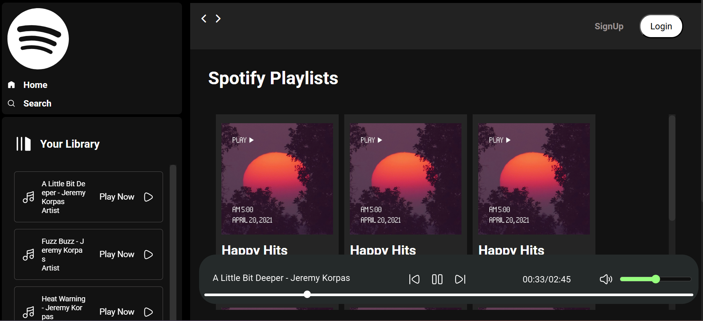

# 🎧 Spotify Clone – Music Player App

A beautiful and interactive **Spotify-inspired music player** built using **HTML, CSS, and JavaScript**. This web-based app allows users to browse a playlist, play songs, pause/resume, and view progress and duration — all with an elegant UI that closely resembles the Spotify experience.

## 🚀 Features

- Spotify-like layout with sidebar, playlists, and controls
- Dynamic loading of `.mp3` songs from a local Node.js server
- Play, pause, next, and previous song functionality
- Seekbar to skip within the track
- Volume control slider
- Current time and duration display
- Responsive sidebar toggle for smaller screens

## 📸 Preview




## 🛠️ Tech Stack

- **HTML5**
- **CSS3**
- **Vanilla JavaScript**
- **Font Awesome**

## 📂 Folder Structure

```
spotify-clone/
├── css/
│   ├── style.css
│   └── utility.css
├── svgs/                 # SVG icons used in the app
├── songs/                # Folder served by Node.js containing your .mp3 files
├── script.js             # Main JavaScript logic
├── index.html            # HTML structure
```

## 🧪 How to Run

1. Clone the repo:
   ```bash
   git clone https://github.com/yourusername/spotify-clone.git
   cd spotify-clone
   ```
   
2. Open `index.html` in your browser.

> 🔈 Make sure your `.mp3` files are placed inside the `/songs` folder and accessible via the server.


## 📦 Future Enhancements

- Add search functionality
- Song metadata display (album, artist, artwork)
- Create and save custom playlists
- Add song progress animation

## 🙌 Author

Made with 💚 by [Manik](https://github.com/manik2005d)

## 📄 License

This project is licensed under the [MIT License](LICENSE).
